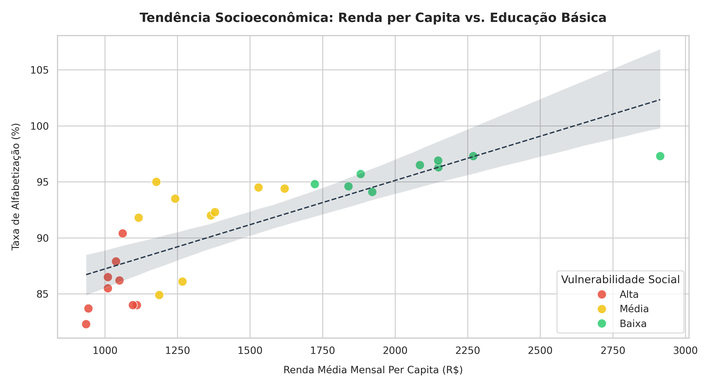

# Análise de Tendência Socioeconômica: Renda Média vs. Alfabetização com Python (IBGE)

Este projeto analisa o impacto da renda na educação brasileira usando dados da API do IBGE (SIDRA), executando todo o processo de análise via Python no navegador.

---

## 🚀 Execução Direta (Sem Instalação)
Você pode executar o script, recalcular regressões e visualizar o gráfico online usando o console Pyodide:
[Executar Projeto Online](https://pyodide.org)

---

## Visualização dos Dados
O gráfico cruza a renda média per capita mensal (eixo X) com a taxa de alfabetização (eixo Y), evidenciando a relação entre infraestrutura econômica e desenvolvimento social.

---

## 🔍 Análise do Gráfico
*   **Tendência Linear Positiva:** Comprova a correlação positiva: estados com maior renda (direita) possuem maiores taxas de alfabetização.
*   **Vulnerabilidade:** A cor vermelha indica alta vulnerabilidade (baixa renda/alfabetização), amarela a transição, e verde a consolidação social.
*   **Jitter:** Utilizado para melhorar a visualização e evitar sobreposição de estados próximos.

---

## Conceitos Aplicados
*   Consumo de APIs Públicas (IBGE/SIDRA).
*   Correlação de Pearson (`scipy.stats`).
*   Categorização Dinâmica de Variáveis.
*   Data Visualization com `seaborn`.

---

## 💬 Contribuições
*   Sugira mudanças via [Issues](https://github.com).
*   Debata no campo de [Discussions](https://github.com).
